# **Mountain Valley Hotel Management App**

  
_Custom-built application to manage everything about the hotel: bookings, cabins, and guests._

---

## **Overview**

The **Mountain Valley Hotel Management App** is a custom-built React application designed to streamline hotel operations. It enables hotel employees to manage bookings, cabins, and guest information efficiently. Built with modern web technologies and powered by **Supabase** for backend and database functionality, this app ensures a seamless user experience.

---

## **Screenshots**

Explore the app's interface through these screenshots:

| Dashboard                                      | Cabin Management                                       | Booking Management                                  |
| ---------------------------------------------- | ------------------------------------------------------ | --------------------------------------------------- |
| 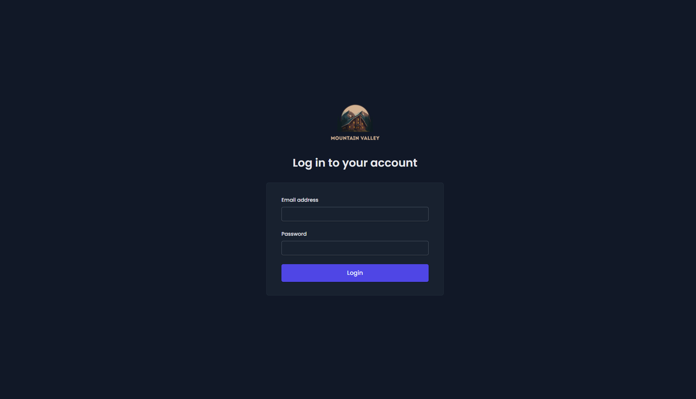     | 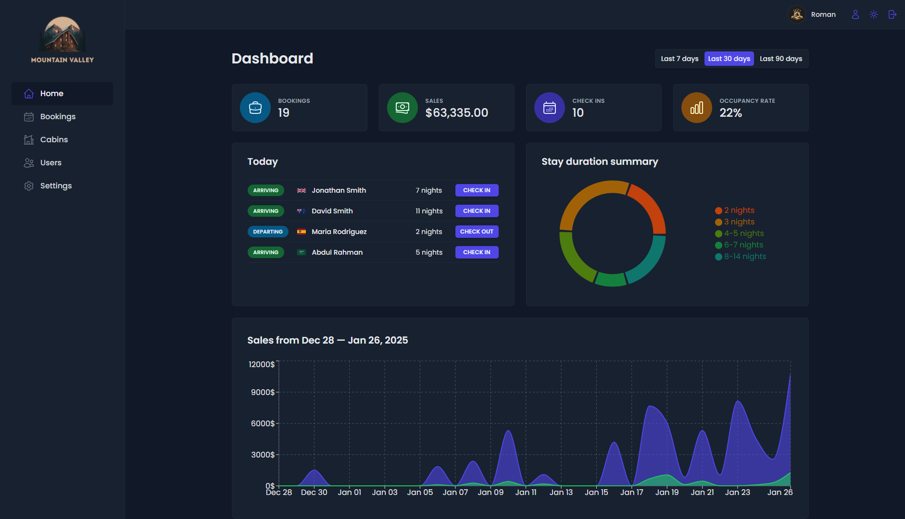      | 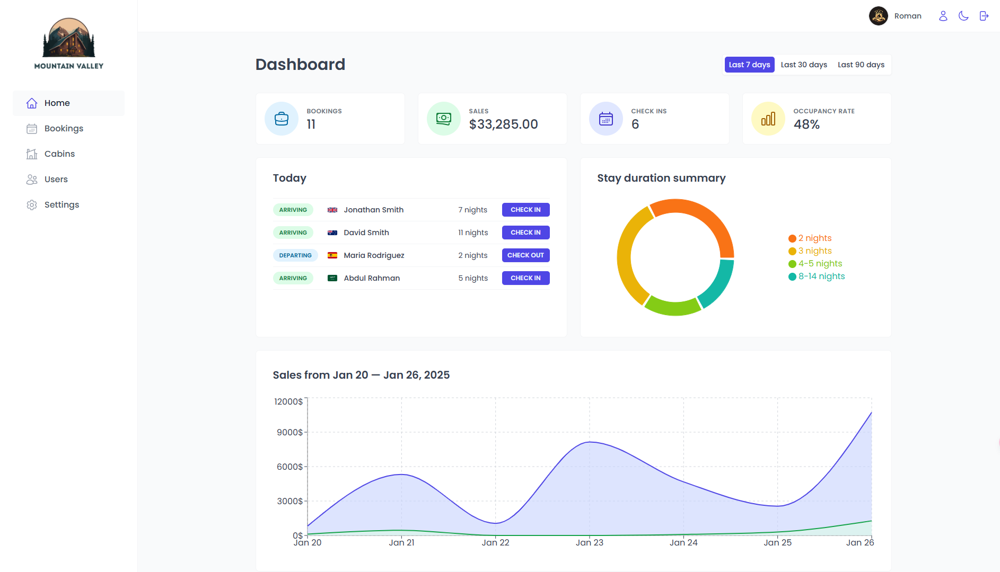 |
| 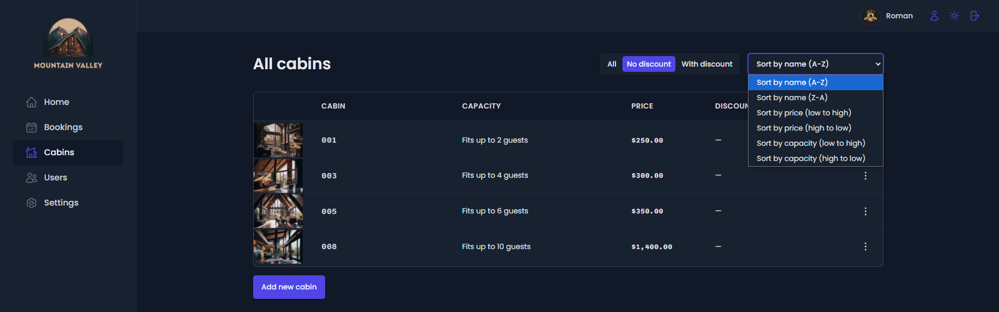 | 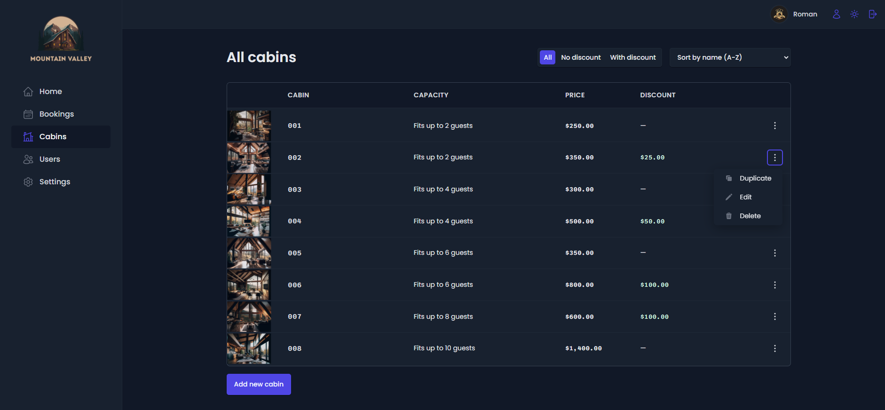              | 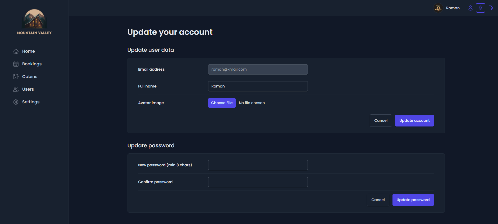             |
| 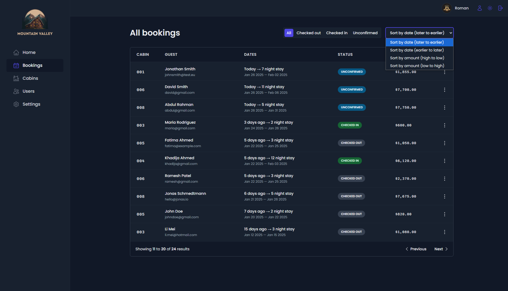     | 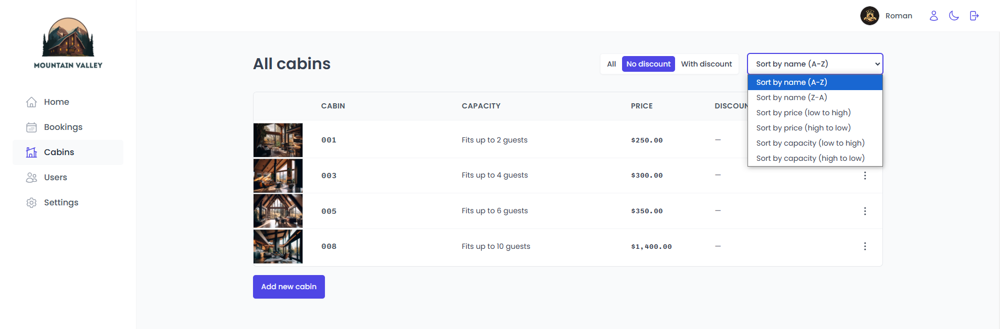                 | 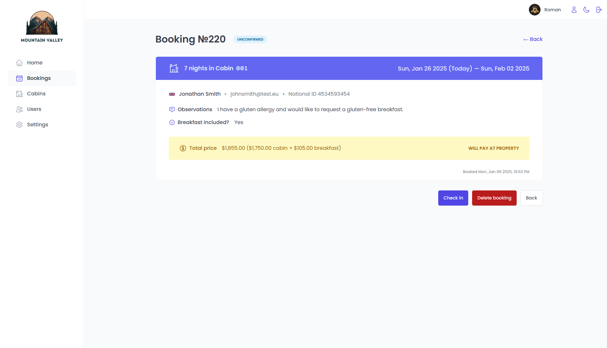            |
| 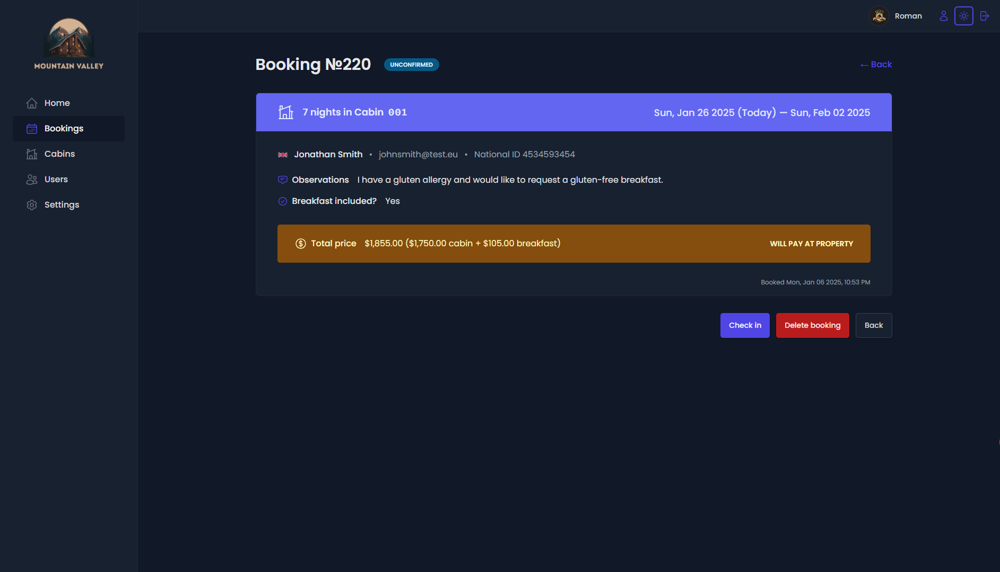     | 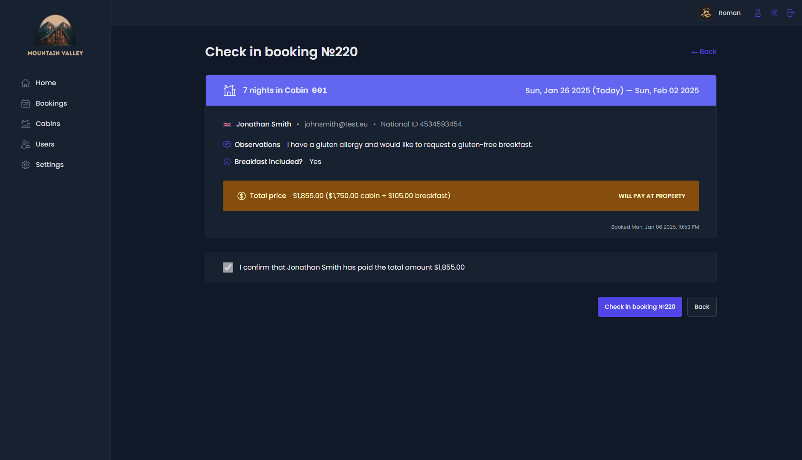 |                                                     |

---

## **Key Features**

### **Authentication & User Management**

-   **Employee Login**: Only logged-in hotel employees can access the application.
-   **User Signup**: New users can only be created within the app to ensure security.
-   **Profile Management**: Employees can upload an avatar, update their name, and change their password.

### **Cabin Management**

-   **Table View**: Displays all cabins with photos, names, capacities, prices, and current discounts.
-   **CRUD Operations**: Create, update, and delete cabins, including uploading cabin photos.

### **Booking Management**

-   **Table View**: Shows booking details such as arrival/departure dates, status, payment amount, cabin data, and guest information.
-   **Booking Status**: Filterable by "unconfirmed," "checked in," or "checked out."
-   **Additional Booking Data**: Includes the number of guests, nights, observations, breakfast booking status, and breakfast price.
-   **Actions**: Delete, check in, or check out bookings.
-   **Payment Handling**: Accept payments outside the app and confirm receipt within the app during check-in.
-   **Add Breakfast**: Guests can add breakfast for their entire stay during check-in if not already booked.

### **Guest Management**

-   **Guest Data**: Full name, email, national ID, nationality, and country flag for easy identification.

### **Dashboard**

-   **Daily Tasks**: View and manage guests checking in or out on the current day.
-   **Statistics**: Insights into recent bookings, sales, check-ins, and occupancy rates.
-   **Charts**:
    -   Daily hotel sales (total and extras like breakfast).
    -   Stay duration statistics.
-   **Time Filters**: Display data for the last 7, 30, or 90 days.

### **Settings**

-   Define application-wide settings:
    -   Breakfast price.
    -   Minimum and maximum nights per booking.
    -   Maximum guests per booking.

### **Dark Mode**

-   A built-in dark mode for better usability in low-light environments.

---

## **Technology Stack**

This application leverages the following modern technologies:

### **Frontend**

-   **Routing**: [React Router 6](https://reactrouter.com/)
-   **Styling**: [Styled Components](https://styled-components.com/)
-   **Remote State Management**: [React Query](https://tanstack.com/query)
-   **UI State Management**: [Context API](https://reactjs.org/docs/context.html)
-   **Form Management**: [React Hook Form](https://react-hook-form.com/)

### **Backend & Database**

-   **API**: Built using [Supabase](https://supabase.com/), a powerful open-source alternative to Firebase.

### **Other Tools**

-   **React Icons**: For icons.
-   **React Query Devtools**: For debugging queries.
-   **Pagination with React Query**: For paginated data fetching.
-   **Pre-Fetching with React Query**: For optimized data loading.
-   **React Hot Toast**: For toast notifications.
-   **Date Fns**: For date manipulation.
-   **PropTypes**: For prop validation.
-   **React Portal**: For rendering elements outside the DOM hierarchy.
-   **Compound Components Pattern**: For reusable UI components.
-   **Render Props Pattern**: For dynamic component rendering.
-   **Custom Hooks**: For reusable logic.
-   **Dark Mode**: For enhanced user experience.
-   **Recharts Library**: For interactive charts.
-   **React Error Boundary**: For error handling (using the `react-error-boundary` library).

---

## **Getting Started**

### **Prerequisites**

-   Node.js (v16 or higher)
-   npm or yarn
-   Supabase account (for backend and database)

### **Installation**

1. Clone the repository:

    ```bash
    git clone https://github.com/your-username/mountain-valley-hotel-app.git
    cd mountain-valley-hotel-app
    ```

2. Install dependencies:

    ```bash
    npm install
    ```

3. Set up Supabase:

    - Create a project on [Supabase](https://supabase.com/).
    - Copy the `.env.example` file to `.env` and fill in your Supabase credentials:
        ```bash
        cp .env.example .env
        ```
    - Update the `.env` file with your Supabase URL and API key.

4. Start the development server:

    ```bash
    npm start
    ```

5. Open the app in your browser:
    ```
    http://localhost:3000
    ```

---

## **Usage**

-   **Login**: Use the provided employee credentials to log in.
-   **Dashboard**: Access key metrics and daily tasks from the dashboard.
-   **Manage Cabins**: Add, edit, or remove cabins from the cabins table.
-   **Manage Bookings**: Handle guest bookings, check-ins, and check-outs.
-   **Settings**: Configure application-wide settings like breakfast price and booking limits.

---

## **Future Enhancements**

-   **Editing Bookings**: Allow users to edit existing bookings.
-   **Advanced Analytics**: Introduce more detailed charts and reports.
-   **Multi-language Support**: Add support for multiple languages.
-   **Mobile App**: Develop a mobile-friendly version or a standalone mobile app.

---

## **Contributing**

Contributions are welcome! Please follow these steps:

1. Fork the repository.
2. Create a new branch (`git checkout -b feature/YourFeatureName`).
3. Commit your changes (`git commit -m 'Add some feature'`).
4. Push to the branch (`git push origin feature/YourFeatureName`).
5. Open a pull request.

---

## **License**

This project is licensed under the MIT License. See the [LICENSE](LICENSE) file for details.

---

## **Contact**

For questions or feedback, feel free to reach out:

-   **Email**: your-email@example.com
-   **GitHub**: [@your-username](https://github.com/your-username)

---

## **Acknowledgments**

-   Thanks to [Supabase](https://supabase.com/) for providing the backend infrastructure.
-   Inspired by modern hotel management practices and tools.

---
